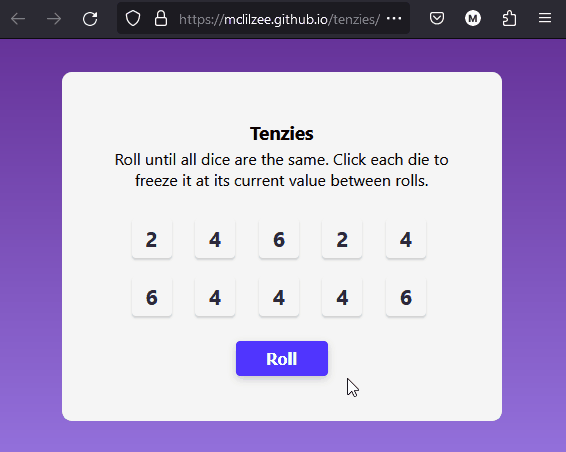
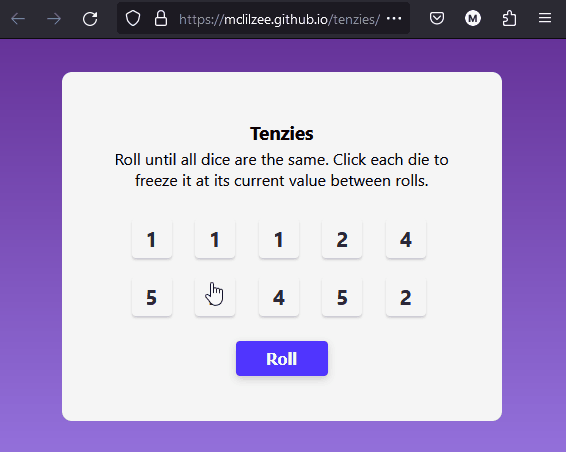

# <a href="https://mclilzee.github.io/tenzies/">Tenzies</a>
A very simple dice game called tenzies, where you get to roll the dice and choose which one to roll next until you get all dice to be the same number, and your score will be how many times did you roll the dice.
A game of dice, tenzies

# Example

### Rolling

### Choosing numbers

